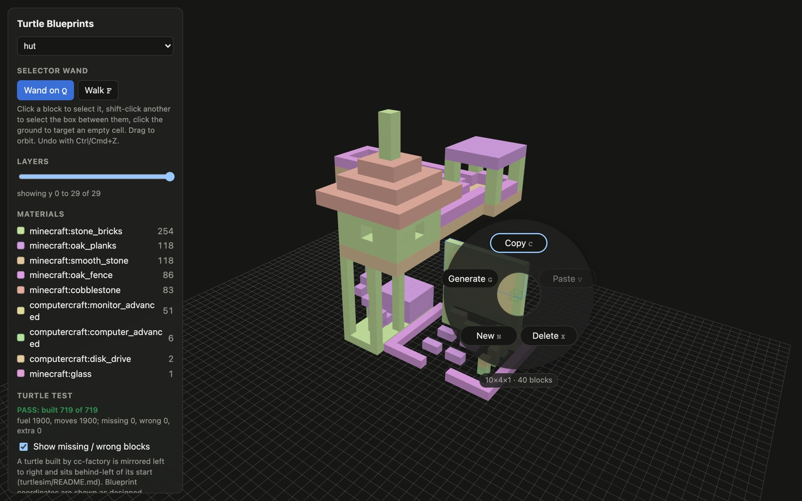
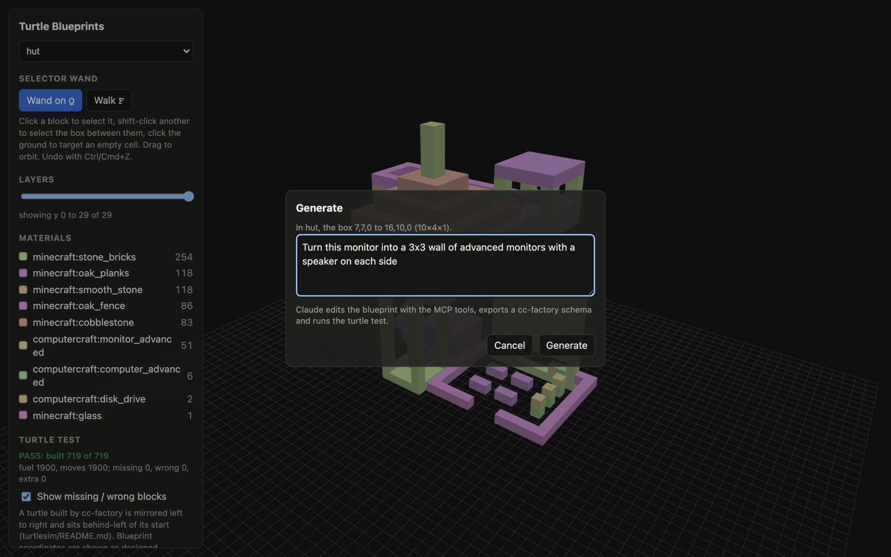
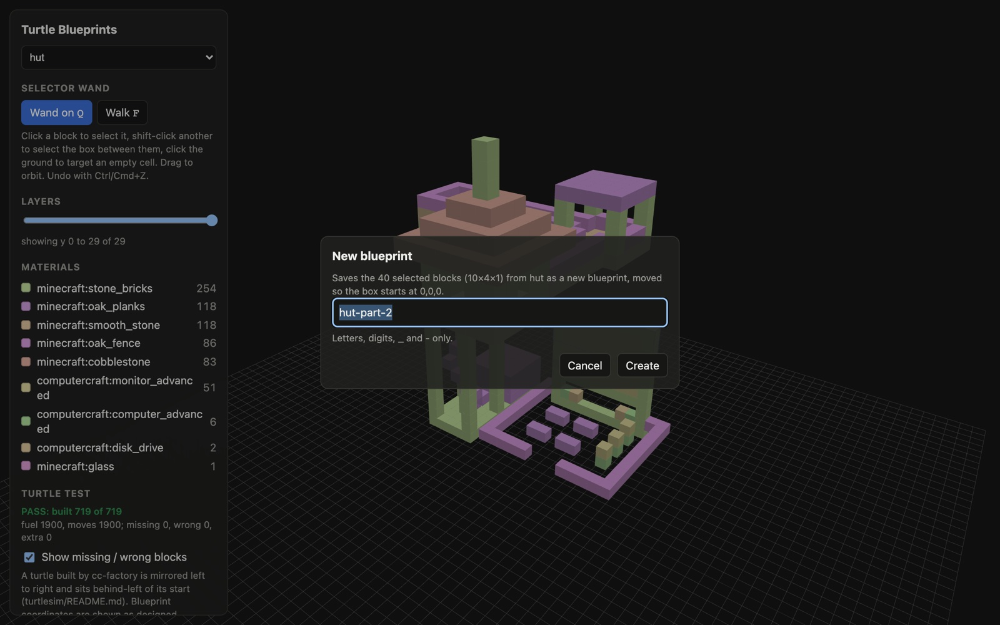
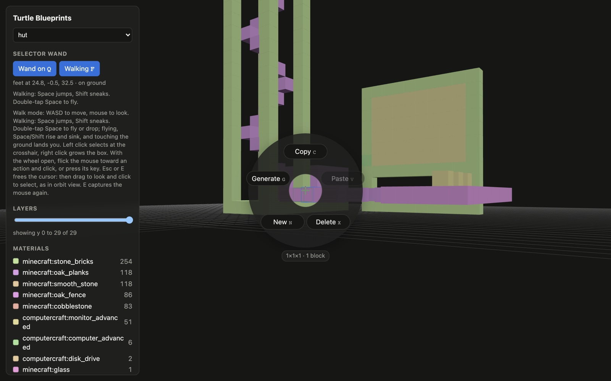

# turtle-blueprints

Design a build with Claude, see it in 3D, then test it on a simulated ComputerCraft turtle.

```
Claude ──MCP──► blueprint files (.blueprint.json) ──► viewer (three.js, live reload)
                      │
                      └─► cc-factory schema ─► turtlesim ─► built vs planned ─► viewer overlay
```

Blueprint files on disk are the source of truth. The MCP server holds no state, so edits from Claude, the CLI and your editor all agree.

## Packages

| package | what it does |
| --- | --- |
| `packages/blueprint` | sparse voxel model, namespaced block ids (`mod:block[state]`), `set`/`fill`/`clear` ops, validation, material counts, build plan (64-stacks, turtle slots); `@tb/blueprint/store` reads and manages the files; `@tb/blueprint/gadgets` exports Building Gadgets 2 templates |
| `packages/cc-bridge` | exports cc-factory's layered text or blocks JSON, normalises to `layer:0`, finds a cc-binaries checkout, and `ccToWorld` (where cc-factory actually places a block) |
| `packages/tester` | builds a turtlesim world from a blueprint, runs `factory.lua`, diffs placed blocks against the blueprint |
| `packages/mcp` | stdio MCP server: `blueprint_new/apply/get/validate/export_cc/export_gadgets/list/manage/build_plan`, `test_run_build` |
| `packages/assets` | `npm run assets`: builds a block catalog and texture cache from your local ATM10 install (jars, not committed) |
| `packages/web` | viewer and file manager: create, rename, duplicate, describe, archive/restore; layer slicer; build prep checklist and schema download; test report and missing/wrong overlay; selector wand (copy, paste, delete, generate) |

## Setup

```bash
npm install
npm test
```

Tests that run the real simulator need CraftOS-PC and a [cc-binaries](https://github.com/Arcadesys/cc-binaries) checkout that has `turtlesim/` with `--file`, `--results` and `--dump-blocks`, plus the `factory.lua` schema-path fix. Point `CC_BINARIES` at it (default `../cc-binaries`). They skip when it is missing.

## Use with Claude Code

```json
{
  "mcpServers": {
    "turtle-blueprints": {
      "command": "npx",
      "args": ["tsx", "packages/mcp/src/server.ts"],
      "env": { "TB_BLUEPRINTS": "blueprints", "CC_BINARIES": "../cc-binaries" }
    }
  }
}
```

Build the block catalog and textures once (reads your CurseForge ATM10 instance and the vanilla 1.21.1 jar, takes seconds, writes the gitignored `.assets/`). Override paths with `ATM10_INSTANCE`, `MC_CLIENT_JAR` and `TB_ASSETS`:

```bash
npm run assets
```

View the blueprints (reloads as files change):

```bash
TB_BLUEPRINTS=blueprints npm run dev -w @tb/web
```

## Managing blueprints

Each blueprint is `blueprints/<name>.blueprint.json`. From the viewer or Claude (`blueprint_manage`) you can create, rename, duplicate, describe, archive and restore. Archiving moves the file to `blueprints/.archive/`; nothing is deleted. A rename carries the blueprint's turtle test results with it.

## Getting ready to build in game

1. Open the blueprint in the viewer and check **Build prep**: every material in 64-stacks and how many of the turtle's 16 slots the build needs. Fix any warnings (blocks a turtle cannot place).
2. Tick materials off as you gather them (ticks are kept in your browser), or **Copy checklist** to paste somewhere else. Claude's `blueprint_build_plan` gives the same list.
3. **Download schema** saves the cc-factory file (`<name>.txt`, or `.json` for very large palettes). Copy it onto the turtle, for example into `saves/<world>/computercraft/computer/<id>/`, and run `factory <name>.txt`.
4. Load the turtle with the materials and fuel. cc-factory builds behind-left of the turtle, mirrored left to right (see below).

### With Building Gadgets 2 (All the Mods 10)

Blueprints export as Building Gadgets 2 templates, the JSON its Template Manager copies and pastes.

1. In the viewer press **Copy for Building Gadgets** (or ask Claude for `blueprint_export_gadgets`, which writes `blueprints/exports/<name>.bg2.json`; copy that file's contents).
2. In game, open a Template Manager, put your Copy-Paste Gadget (or a template or paper) in it, and press **Paste**. The gadget now holds the build; place it like any copy.
3. In survival the gadget takes the blocks from your inventory or linked storage, so gather from the Build prep list first.

Unlike turtles, the gadget keeps blockstate (stairs facing, log axis). Two-block things such as doors and beds need both halves in the blueprint. Every cell of the bounding box is encoded, so very large builds make large templates; split them if a paste is slow or rejected.

### Build tool

Search any ATM10 block in the sidebar and click a result to put it in the selected hotbar slot (keys 1-9). Press `B` (or the Build button; it swaps with the wand) and build by hand: right click places on the clicked face, left click breaks, middle click picks the block under the cursor. Placement follows Minecraft: stairs and furnaces face you, stairs take top or bottom from where you click, logs take the clicked axis, and two slabs merge into a double. It works from orbit view and, while walking, from the crosshair. Undo is the same Ctrl/Cmd+Z as the wand's.

Blocks are drawn with their real textures from your local install. Slabs render at half height and stairs as half-height slabs; other non-cube models are textured cubes, and about 3,000 of the 53,000 blocks with custom textures show a flat colour.

### Selector wand



The viewer has a selector wand (toggle with `Q`). Click a block to ping and select it, shift-click a second block to select the box between them, or click the ground to target an empty cell. Dragging still orbits. Each click opens an action wheel:

| action | key | what it does |
| --- | --- | --- |
| Copy | `C` | copies the selected blocks (air is not copied) |
| Paste | `V` | pastes onto the clicked face, or at the clicked ground cell |
| Delete | `X` | clears the selected box |
| New | `N` | saves the selected blocks as a new blueprint (moved so the box starts at 0,0,0), or starts an empty one when nothing is selected, then switches to it |
| Generate | `G` | asks for a request in plain words, then runs headless Claude Code with only this MCP server: it edits the blueprint around the selection, validates it, exports a cc-factory schema to `blueprints/exports/`, and runs the turtle test. Progress and the result show in the sidebar. |

Press `F` to walk, first person like Minecraft creative: WASD and the mouse to look. You start flying (Space/Shift rise and sink); double-tap Space to drop and walk with gravity (Space jumps, Shift sneaks), and double-tap again to fly. Landing on the ground ends a flight. Blocks you can see are solid; if you start inside one you can move out freely. The wand aims from the crosshair while walking: left click selects, right click grows the box, and with the wheel open you flick the mouse toward an action and click (the keys still work). With the cursor free (Esc or `E`, or if the browser refuses to capture the mouse) you keep walking, drag to look, and the wand aims at the cursor; `E` captures the mouse again. Generate frees the cursor so you can type.

| | |
| --- | --- |
|  |  |



Paste and delete write the blueprint file directly. `Ctrl/Cmd+Z` undoes them, and undoes a whole Generate. Generate needs `claude` on the PATH (or set `TB_CLAUDE`), and passes `CC_BINARIES` through for the turtle test.

## Limits to know about

- A turtle test must fit in the turtle's 16 inventory slots (about 1000 blocks); cc-factory does not pull from chests when checking requirements.
- Turtles place a block as the item of the same name. Blockstate (stairs, log axis) is carried but ignored, and doors, beds, redstone dust and fluids will not place.
- cc-factory builds mirrored left to right and behind-left of the turtle. The diff accounts for it; the viewer shows the blueprint as designed.
- A turtlesim exit status only says it did not crash. Judge a build by the report.
